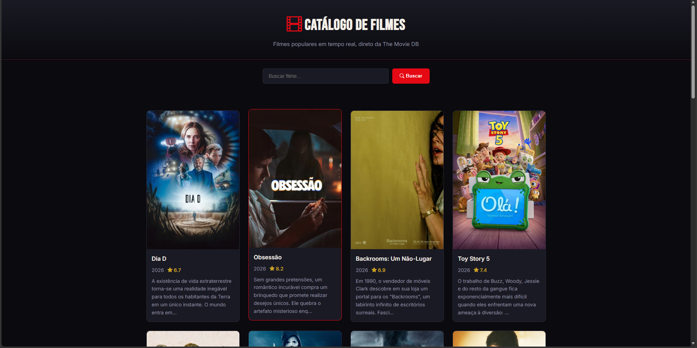
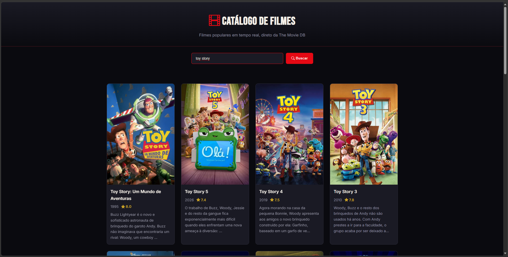

Trabalho Prático - Semana 12
Nesta atividade, vamos trabalhar com uma API de mercado para montar uma interface de visualização de filmes. Para isso, vamos utilizar a The Movie DB API. A página resultante deve listar os resultados de uma requisição HTTP no formato de cards e deve incluir uma funcionalidade de pesquisa ou filtro.

Informações Gerais
Nome: Lucas Dutra Figueiredo
Matricula: 908372
Prints do trabalho
<< COLOQUE A IMAGEM - LISTA DE CARDS COM FILMES - AQUI >>

<< COLOQUE A IMAGEM - RESULTADO DE UMA PESQUISA - AQUI >>
